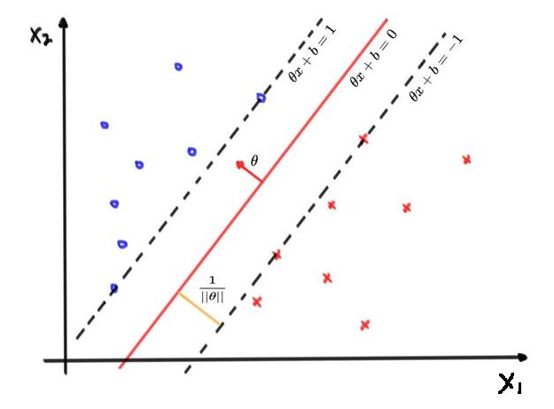

根据SVM正负例都在间隔上或间隔外，样本需满足以下条件：
$$
\frac{\theta ^ T x^{(i)} + b}{||\theta||} \ge d,\ \ y^{(i)} = 1 \\
\frac{\theta ^ T x^{(i)} + b}{||\theta||} \le d,\ \ y^{(i)} = -1
$$
不等式左右同时除以d得：
$$
\frac{\theta ^ T x^{(i)} + b}{||\theta||d} \ge 1,\ \ y^{(i)} = 1 \\
\frac{\theta ^ T x^{(i)} + b}{||\theta||d} \le 1,\ \ y^{(i)} = -1
$$
上式中主要关注$\frac{\theta ^T}{||\theta||d}$和$\frac{b}{||\theta||d}$，可以发现，本质没有什么变化，只是在原基础上进行了一定程度的缩放，所以等式可简化为：
$$
\theta ^ T x^{(i)} + b \ge 1,\ \ y^{(i)} = 1 \\
\theta ^ T x^{(i)} + b \le 1,\ \ y^{(i)} = -1
$$
综合上面两种情况，将$y^{(i)}$乘进去，可以写成一个不等式：
$$
y^{(i)}\theta ^ T x^{(i)} + b \ge 1
$$
同时，可以通过计算，求得支持向量到分类边界的间隔为：
$$
d = \frac{\theta^Tx +b}{||\theta||} = \frac{1}{||\theta||}
$$
所以，要想获得最大间隔的SVM，即要满足约束条件同时最大化几何间隔：
$$
max(\frac{1}{||\theta||}) \\ 
s.t. \ \ y^{(i)}(\theta ^T x^{(i)} + b) \ge 1
$$

